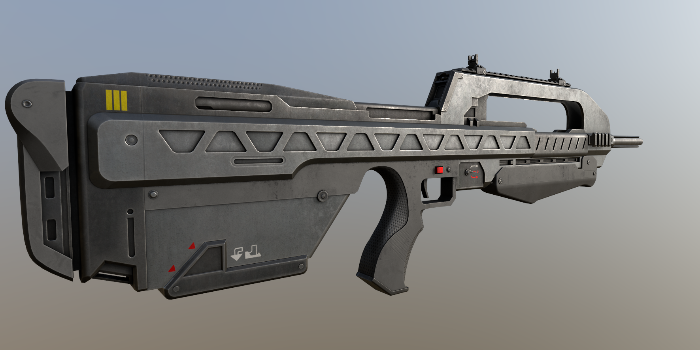
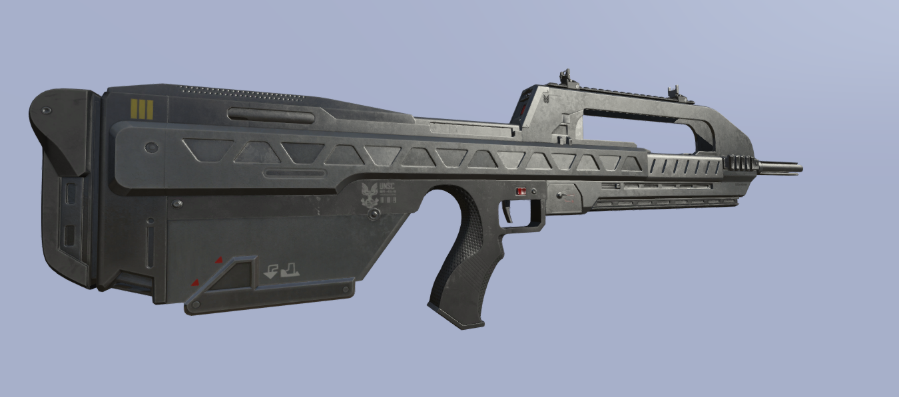

# Overview 
Substance Painter Export Preset is in the releases section.

## CO Map:
Base color, darken or lighten stuff depending on how it looks in game, because some colors just don't look good the way Arma lighting is set up, unsure how to fix this yet.

## CA Map:
Base color, same idea as above but this texture map has an opacity channel in the alpha.

## AS Map:
Ambient Occlusion/Shadows, follows the same idea as modern Ambient Occlusion maps, but the red channel is full white, the green channel is the ambient occlusion, and the blue channel is white.

## SMDI Map:
It's now completely automated, but long story short I combined and blended Roughness and Glossiness until it matched the base game colors and levels. Please let me know how things look with this new workflow.

## NOHQ Map:
Normal map, DirectX format, nothing complex or weird here. Avoid using extreme values for your normal or height mapping, as it can cause pixilation in the texture when you look at in game and very strange lighting.

## Emissive Map:
You paint where you want things to glow that color, this is coming soon and you have to use TexGens + SuperExt shader and slot it into Stage8. Not technically fully working yet but I'll add the export, more info is found here in the [ARMA discord](https://discord.com/channels/105462288051380224/105781923573456896/1438178556294332576)  

## New SMDI Generator Usage

## Example
Substance Painter

Arma 3 - Buldozer

## Final Notes: 
I am aware that my texture conversion as shown above might not be perfect, but it gets you pretty close and with some more fine tuning of the RVMat it will get it as close as possible with consideration of the outdated lighting engine in Arma 3. With the thanks to all the other modders who discussed this with me and helped me learn more, I hope you find use out of this guide and learned something new today. The lighting will never be perfect in Arma because of the wide variety of lighting scenarios, but if it looks good in default clear sky Stratis lighting, then it should in theory look good everywhere else. I would suggest downloading the RVMat I have provided as a good example of what to do for textures, feel free to use it as a base. If you have any specific questions, my Discord is scouter407.
